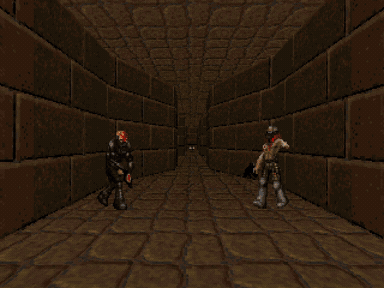

# Sight



*A from-scratch PPO policy clearing ViZDoom `deadly_corridor` at max difficulty (skill 5): one full episode, 6 kills, armor reached. Trained on one laptop GPU via a skill-3 curriculum; result replicated on 3 seeds. Details below and in `docs/vzd-deadly-corridor-findings.md`.*

Sight is a local-first reinforcement-learning lab: a hobby and portfolio project for learning modern RL by training small policies, from scratch, on a single older gaming laptop. It is not a product, a startup, or a QA tool. Success is defined by learning progress and reproducible local training, not by users, revenue, or downstream commercial intent.

The environments are **Signal Dodge**, a custom Godot micro-game owned by this repo and exposed as a Gym-style environment (policies are scored against a constant-action baseline of mean episode length 930.27; because that baseline is itself a fixed action, anything that clears it has to actually dodge), and **ViZDoom** (`defend_the_center` and `deadly_corridor`), an approved second target for pixel-based RL. Gymnasium classic-control environments are used alongside them for formal grounding.

**Non-goals, stated up front and permanently.** Sight does not target live commercial games. It does not touch Freecash, offerwalls, or any paid-engagement platform. It does not develop bot-detection evasion, account farming, or identity spoofing. It does not produce assets or tooling that could drop into a live-service cheat pipeline. These are not current priorities or performance constraints; they are permanent project boundaries. PRs that cross them are closed without review. See `docs/ethics.md` and `CONTRIBUTING.md`.

## Results

| Environment | Method | Score | Verdict |
|---|---|---|---|
| ViZDoom defend_the_center (pixels) | PPO CnnPolicy, gamma 0.99, 2.25M steps, RTX 4080 Laptop | mean 12.2 / IQM 12.8 kills per episode, 30 deterministic eps (untrained ~0) | strong; 30s clip at `runs/vzd/ppo_defend/gameplay.mp4` |
| ViZDoom defend_the_center (pixels) | Distillation: BC student from 100 teacher-rollout episodes (20k frames, 93.4% action match) | student mean 12.6 / IQM 13.3 vs teacher 12.2 / 12.8, 30 eps | lossless within noise; both near the 15-kill scenario ceiling |
| ViZDoom deadly_corridor skill 5 (pixels) | Flat-reward PPO, no curriculum | IQM 93.6, 14/30 episodes byte-identical | fails: entropy collapse from unnormalized ~1000x reward scale, sprint-and-die local optimum |
| ViZDoom deadly_corridor skill 5 (pixels) | Curriculum (skill-3 shaped+VecNormalize 1.5M steps, then skill-5 resume-finetune to 3.0M, ent-coef re-injected) | IQM 2279.67 / 2280.44 / 2279.69 on 3 seeds vs bar 93.6; combat probe FIGHT on all seeds, 5.8-5.9 kills/ep, 28-29/30 survived | clears decisively; full pipeline replicated end-to-end on 3 seeds; clip at `runs/vzd/demos/corridor_s5_ft_seed1.mp4` |
| Signal Dodge (state) | Behavioral cloning from oracle demos | mean episode length 1737.3 vs bar 930.27 | clears reliably |
| Signal Dodge (state) | PPO fine-tune from BC init | mean 1710.5 vs bar 930.27 (10 seeds) | clears reliably |
| Signal Dodge fast replica | From-scratch PPO, gamma 0.99 + start-state curriculum, 5M steps | IQM 1800 (episode cap) on 5/5 seeds | clears, after two structural fixes |
| Signal Dodge (real Godot) | Same from-scratch recipe, 1M / 5M steps | mean 635 / 574 vs bar 930.27 | does not clear; 5x compute did not help |

**The load-bearing finding: the discount factor.** Every from-scratch failure on Signal Dodge traced to one cause. At gamma 0.999 (effective horizon ~1000 steps) the PPO critic's return targets were too high-variance to fit: explained variance sat near zero and no amount of exploration tuning or capacity helped. Cutting gamma to 0.99 (horizon ~100) fixed the critic outright (explained variance 0.94+), and a start-state curriculum (inject hazards above the player at reset, annealed to zero over 70% of training) was the second required ingredient. The same gamma-0.99 lesson transferred directly to ViZDoom, where the critic was healthy from the first checkpoint.

**The curriculum-transfer finding (deadly_corridor).** From-scratch PPO at skill 5 collapses the same way every time: the corridor's reward is ~1000x defend_the_center's scale, the value loss saturates the shared CNN trunk, entropy hits zero by 300k steps, and the frozen policy sprints down the distance-shaping gradient and dies (IQM 93.6). The fix is two preconditions plus a curriculum: VecNormalize return scaling (the canonical PPO remedy, per Pop-Art and the CleanRL implementation-details lineage) and game-variable reward shaping that pays for kills, trained at skill 3, then resumed at skill 5 with the entropy coefficient re-injected after `PPO.load` (which silently restores the checkpoint's value otherwise). That pipeline took the same architecture from IQM 93.6 to ~2280 at skill 5, and an engine-counter probe confirms the policy fights (5.8-5.9 kills per episode, 28-29 of 30 episodes survived) rather than exploiting the distance reward. The whole two-stage pipeline was replicated end-to-end on three seeds, all landing within a 4-point band; seed 2 ran fully unattended, including the stage handoff. Full story in `docs/vzd-deadly-corridor-findings.md`.

**The honest negative result.** A 5M-step probe on real Godot (5x the 1M budget) *reshuffled which evaluation start-states the policy survives* rather than accumulating capability: per-eval-seed correlation between the 1M and 5M checkpoints was near zero (Spearman -0.19), the median episode length fell 573 to 393, and the mean fell 635 to 574. Imitation learning clears the bar reliably where from-scratch does not, and is reported as the standing solution for the original env. Results are reported as across-seed distributions with interquartile means (Agarwal et al. 2021), never single lucky seeds.

**Methods exercised.** Value-based RL (DQN), distributional RL (QR-DQN), NoisyNet exploration, imitation learning (BC), teacher-to-student policy distillation, policy-gradient fine-tuning (PPO), evolutionary strategies (CMA-ES, CMA-MAE), offline RL, from-scratch PPO from pixels (CNN), and a self-supervised next-state-prediction track. Logging is structured NDJSON with deterministic seeds; evaluation tracks reward, episode length, action distribution, and a failure taxonomy. Full run stories live in `docs/` (start with `docs/vzd-ppo-teacher-findings.md` and `docs/sd-fast-curriculum-findings.md`).

## Reproduce this result

The headline result is the deadly_corridor curriculum pipeline. Published numbers came from an MSI Raider 18 HX laptop (RTX 4080 Laptop 12 GB, 64 GB RAM) on Windows 11, at 109-118 env-steps/s with 8 parallel envs: about 2.5 h for stage 1 and 3.8 h for stage 2. Versions: Python 3.14.6, vizdoom 1.3.0, stable_baselines3 2.8.0, gymnasium 1.2.3, torch 2.13.0+cu126.

```powershell
# 0. Environment (from the repo root)
py -3.14 -m venv .venv-c1
.venv-c1\Scripts\python.exe -m pip install vizdoom==1.3.0 stable_baselines3==2.8.0 gymnasium==1.2.3
.venv-c1\Scripts\python.exe -m pip install torch --index-url https://download.pytorch.org/whl/cu126

# 1. Stage 1: skill 3, game-variable reward shaping + VecNormalize return scaling
.venv-c1\Scripts\python.exe tools\vzd_ppo_train.py --env-id VizdoomDeadlyCorridor-v1 ^
  --doom-skill 3 --shape-reward --norm-reward --steps 1500000 --seed 0 ^
  --out runs\vzd\ppo_deadly_corridor_s3_shaped

# 2. Stage 2: skill-5 finetune, resumed from the NUMBERED 1.5M checkpoint
#    (the numbered .zip pairs with its step-matched VecNormalize .pkl; model.zip does not).
#    --steps is ADDITIONAL steps on resume (1.5M -> 3.0M total).
#    --ent-coef 0.05 must be passed: PPO.load silently restores the checkpoint's value otherwise.
.venv-c1\Scripts\python.exe tools\vzd_ppo_train.py --env-id VizdoomDeadlyCorridor-v1 ^
  --doom-skill 5 --shape-reward --norm-reward --ent-coef 0.05 --steps 1500000 ^
  --resume runs\vzd\ppo_deadly_corridor_s3_shaped\ppo_deadly_corridor_1500000_steps.zip ^
  --out runs\vzd\ppo_deadly_corridor_s5_ft

# 3. Combat probe: engine-counter verification that the policy fights
.venv-c1\Scripts\python.exe tools\vzd_probe_combat.py ^
  --model runs\vzd\ppo_deadly_corridor_s5_ft\model.zip ^
  --env-id VizdoomDeadlyCorridor-v1 --doom-skill 5
```

Expected numbers. Each stage ends with a 30-episode deterministic eval on raw scenario reward (unshaped, unnormalized), written to `summary.json` in the run dir. Stage 1 should land at IQM 2276-2280 (three seeds produced 2279.43, 2276.58, 2277.95; the flat-reward bar it must beat is 683.9). Stage 2 should land at IQM 2279-2281 (seeds: 2279.67, 2280.44, 2279.69; the no-curriculum collapse bar is 93.6). The probe should report roughly 5.8-5.9 kills per episode with 28-30 of 30 episodes surviving; read KILLCOUNT / HITCOUNT / DAMAGE_TAKEN and ignore SHOTS_FIRED and accuracy, which are contaminated by a stale ammo baseline at reset. GPU training is not bit-reproducible across drivers, so expect the band rather than exact floats; the three published seeds span under 4 points on a 2280-point scale.

The defend_the_center teacher reproduces with the same script and defaults: `tools\vzd_ppo_train.py --steps 2250000` (the published run totaled 2.25M steps), expected mean ~12 kills per episode over 30 deterministic eval episodes against a 15-kill scenario ceiling.

The project is solo and single-voice: one author makes the engineering calls, with an evidence-anchored self-audit (verify every load-bearing claim against on-disk artifacts and re-run the evals) standing in for external review. See `docs/sight-charter.md` for scope, phase gates, success criteria, and decision authority, and `docs/sight-handoff.md` for live status.
